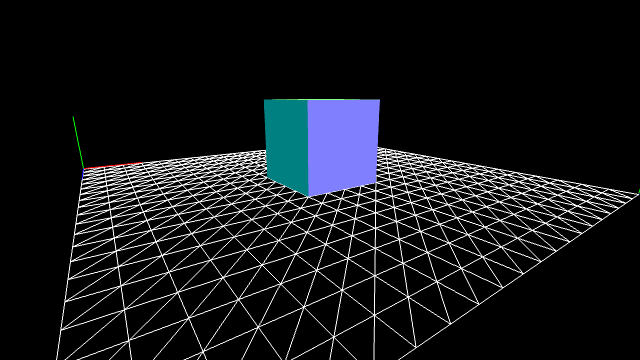
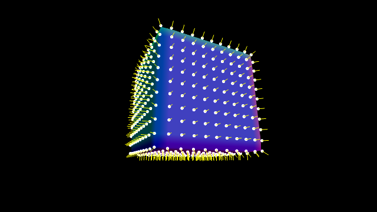
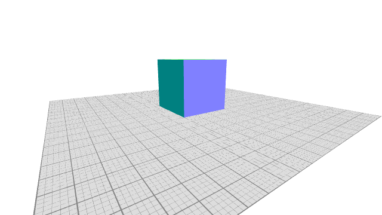

GitHub: [https://github.com/kenjiSpecial/tubugl-tubugl-helper](https://github.com/kenjiSpecial/tubugl-helper)

### [#00 - Grid Helper](./app00/index.html)

[codes](https://github.com/kenjiSpecial/tubugl-helper/blob/master/examples/app00) | [source for gridHelper](https://github.com/kenjiSpecial/tubugl-helper/blob/master/src/gridHelper.js)

### [#01 - Normal Helper](./app01/index.html)

[codes](https://github.com/kenjiSpecial/tubugl-helper/tree/master/examples/app01) | [source for normalHleper](https://github.com/kenjiSpecial/tubugl-helper/blob/master/src/normalHelper.js)

### [#02 - Grid Helper2](./app02/index.html)

[codes](https://github.com/kenjiSpecial/tubugl-helper/tree/master/examples/app02) | [source for gridHelper2](https://github.com/kenjiSpecial/tubugl-helper/blob/master/src/gridHelper2.js)

all examples were made with [tubugl](https://github.com/kenjiSpecial/tubugl)
